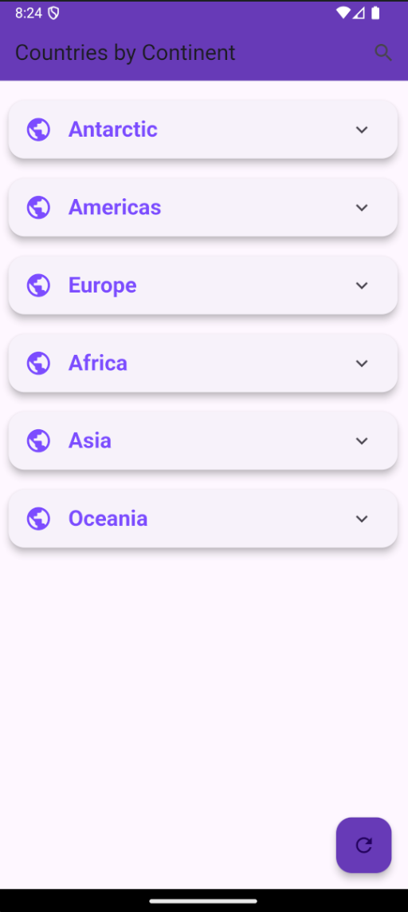

# EarthPedia 🌎

A Flutter application that provides comprehensive information about countries worldwide, utilizing the REST Countries API.

## Features

- **Country Information**: Detailed data including flags, population, capitals, and more
- **Continent-based Organization**: Countries grouped by continents for easy navigation
- **Real-time Search**: Quick country search functionality
- **Offline Support**: Caching system for data persistence
- **Network Status**: Real-time connectivity monitoring
- **Modern UI**: Material Design with custom transitions and animations

## Screenshots

<div align="center">
  
  
</div>

## Technical Stack

- Flutter & Dart
- Provider for State Management
- Dio for HTTP requests
- Hive for local caching
- connectivity_plus for network monitoring

## Getting Started

### Prerequisites
- Flutter SDK (latest stable version)
- Dart SDK
- Android Studio / VS Code
- Android Emulator / iOS Simulator

### Installation

1. Clone the repository
```bash
git clone https://github.com/yourusername/earthpedia.git
```

2. Install dependencies
```bash
flutter pub get
```

3. Run the app
```bash
flutter run
```

## Project Structure
```
lib/
├── controllers/
│   ├── countries_controller.dart
│   └── country_search_delegate.dart
├── models/
│   └── country_model.dart
├── providers/
│   ├── connectivity_provider.dart
│   └── countries_provider.dart
├── screens/
│   ├── home/
│   └── custom_widgets/
└── main.dart
```

## Architecture

- MVC pattern with Provider for state management
- RESTful API integration
- Cached network images
- Custom error handling
- Offline-first approach

## Contributing

1. Fork the repository
2. Create your feature branch
3. Commit your changes
4. Push to the branch
5. Create a Pull Request

## Acknowledgments

- [REST Countries API](https://restcountries.com)
- Flutter and Dart team
- All contributors

## Contact

Peter Johnson - [@max](https://twitter.com/@maxprodigee)


